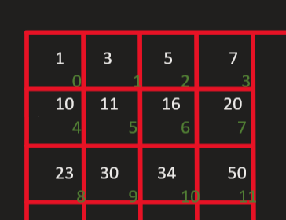

### Array

What is bitonic point in array?
A Bitonic Point is a point in bitonic sequence before which elements are strictly increasing and after which elements are strictly decreasing. A Bitonic point doesn't exist if array is only decreasing or only increasing.

- Monotonic 
An array is said to be monotonic in nature if it is either continuously increasing or continuously decreasing. Mathematically, An array A is continuously increasing if for all i <= j, A[i] <= A[j].

- Two Pointer technique
Two pointers is really an easy and effective technique that is typically used for searching pairs in a sorted array.
Two-pointer technique is commonly used to solve array problems very efficiently. Whenever an array question deals with finding two numbers in an array that satisfy a certain condition, either directly or indirectly, two-pointer should be the first strategy that comes to mind. 

[https://medium.com/swlh/two-pointer-technique-solving-array-problems-at-light-speed-56a77ee83d16]()


In a matrix of m * n size.We can make it flat like below 



Like in above image we have a 3 * 4 (3 rows 4 columns) matrix. Now to flatten it the total number of elements will be 
```
n * m - 1 
```

And for any index element say 5 we can find the row and cloumn as
```
row = index/no of columns;
colums = index % no of columns;
``` 