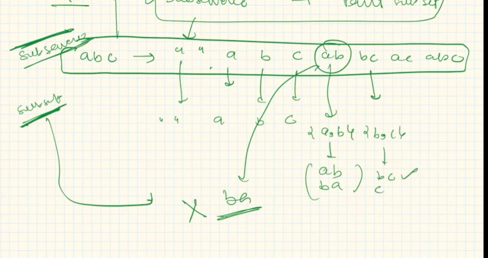

Subsets , substring and subsequence 

Subsets : order does not matter neither need to be continuous. 
substring: Should be continuous
subsequence: need not be continuous but order matters. 

Example: 

[1,2,3];

subsets- {1,2,3,12,13,23, 123, ''}

substring
{a,b,c} => '', a,b,c ,ab,ac,bc, abc
ac is not a valid substring but a valid subsequence. 

subsequence
{a,b,c} => '',a,b,c, ab, ac, bc

